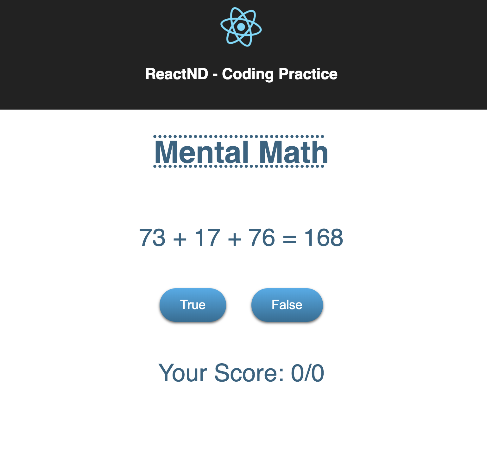
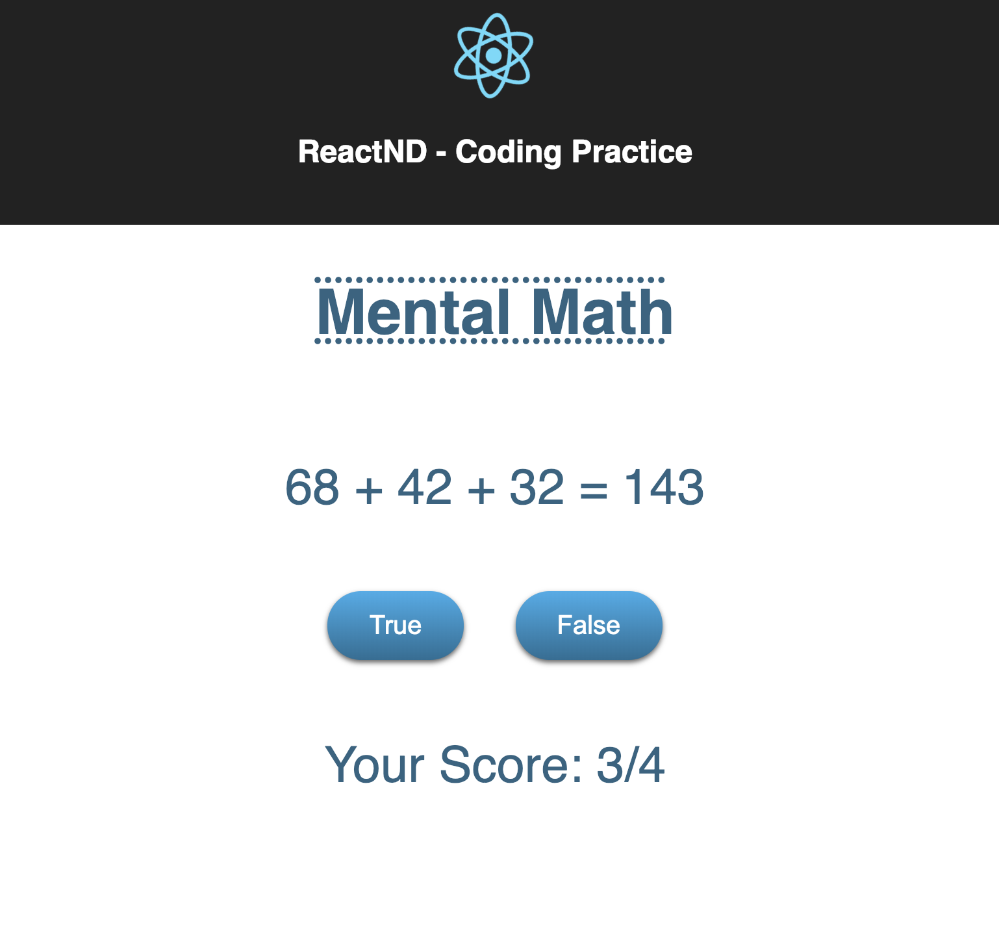

## Running the application
 - `npm install` - for getting the required libs  
 - `npm start` - for opening the application in browser

## About the application

A game that shows an equation of the form X+Y+Z=P.   
Here, X, Y, and Z are random numbers, and P is the proposed answer.   
The user is able to answer weather it is true that the sum of X, Y, and Z
equals the proposed answer P.   
The user gets a point for each question the user answers correctly. 

The score is displayed in this format:   

 `[number of correct answers]/[number of questions answered].`
 
Every time the user answers a question, a new question that uses randomly 
generated numbers is displayed.

The application helps practice the trickiest part of React - managing state.

  

